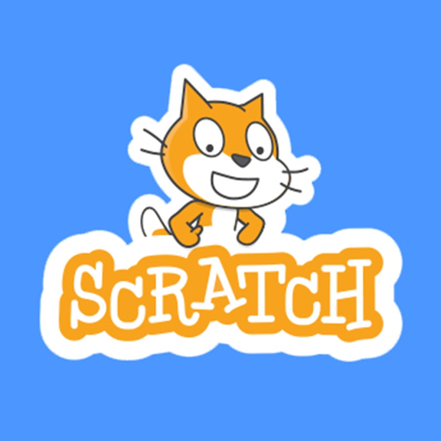

---

# [Hello There!](https://www.youtube.com/watch?v=rEq1Z0bjdwc)
I'm Adam, a *computer engineering student* at [UCT](https://www.uct.ac.za/), *freelance software developer* and *hobbyist game engine developer*. I specialize in C++, graphics programming, physics and databases. I am also well-versed in Kali Linux, ethical hacking, networking and electronics.

> I am currently working on the **Intricate Engine**, a C++ game engine that I started writing from scratch in 2021 that currently features:
> - A [Vulkan](https://www.vulkan.org/) and [DirectX 11](https://en.wikipedia.org/wiki/Direct3D) Renderer
> - C# Scripting with [Mono](https://en.wikipedia.org/wiki/Mono_(software))
> - 3D Physics with [NVIDIA PhysX](https://en.wikipedia.org/wiki/PhysX)

## My Tech Stack
### Languages

### Dev Tools

### Other Tools and Environments

### Operating Systems

---

    
    

---

#### Oh, and I'm also fluent in the best programming language of all time...

    

